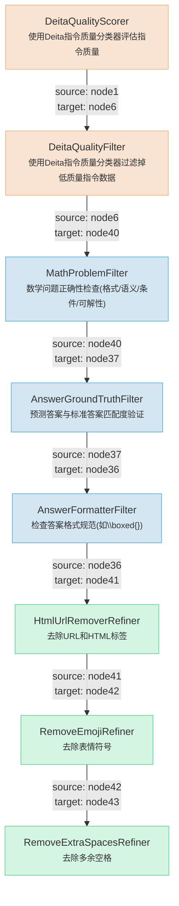

# 安装

本节介绍如何安装DataFlow的依赖环境。

```shell
conda create -n dataflow-agent python=3.10
conda activate dataflow-agent

git clone https://github.com/Open-DataFlow/DataFlow-AgentBot.git
cd DataFlow-AgentBot
pip install -r Dataflow-AgentBot/requirements.txt
```

---

# DataFlow-Agent编排流水线

## 1.概述

DataFlow Agent 是一个基于多智能体协同的自动化任务处理系统，覆盖 **任务拆解 → 工具注册 → 调度执行 → 结果验证 → 报告生成** 的完整流程，致力于复杂任务的智能化管理与执行。可以根据用户的数据类型进行专属的算子推荐，编排，执行，总结。

## 2.一键部署访问

```shell
cd DataFlow-AgentBot

uvicorn main:app --reload
```

`ChatAgentYaml.yaml` 配置你的Agent-API Key：

```yaml
API_KEY: sk-
```

`TaskInfoYaml.yaml` 配置你的算子API Key：

```json
execute_the_recommended_pipeline:
  local_tool_for_execute_the_recommended_pipeline:
    sh_path: 								 pipeline.sh文件保存位置！！！
    env_vars: 
      HF_ENDPOINT: https://hf-mirror.com
      API_KEY: sk-                           Here！！！
    execute: True
    dry_run: false
```

项目启动之后即可通过API的方式进行访问：

```shell
curl -X POST "http://localhost:8000/recommend" -H "Content-Type: application/json" -d '{
  "model": "deepseek-v3",
  "language": "Chinese",
  "target": "根据我的数据类型，帮我推荐pipeline",
  "sessionKEY": "pipeline",
}'
```

或者通过前端的方式访问：

```shell
cd DataFlow-AgentBot

streamlit run frontend_app.py
```

直接进行Pipeline的推荐，你也可以任意的对话，询问关于数据处理的知识或者数据治理的需求，DataFlow-Agent会对你的意图进行分析，直到明确你需要进行pipeline的推荐。

```shell
curl -X POST "http://localhost:8000/recommend" -H "Content-Type: application/json" -d '{
  "model": "deepseek-v3",
  "language": "Chinese",
  "target": "我想知道数据处理有哪些方法？",
  "sessionKEY": "pipeline",
}'

curl -X POST "http://localhost:8000/recommend" -H "Content-Type: application/json" -d '{
  "model": "deepseek-v3",
  "language": "Chinese",
  "target": "什么是SFT数据？",
  "sessionKEY": "pipeline",
}'
```

## 3.数据准备

### 3.1 数据存储

- **支持格式**：`json`、`jsonl` 、 `pdf`  

- **支持存储形式**：`文件系统`、`Myscale数据库`

#### 3.1.1 文件系统

- `json，json`l类型数据存放到：`DataFlow-AgentBot\data\json`
- `pdf`类型数据存放到：`DataFlow-AgentBot\data\pdfs`（如果使用pdf作为原始输入，需要先配置好MinerU的环境）
- 支持Minio云文件上传下载服务；

#### **3.1.2 Myscale**

如果使用Myscale存储jsonl数据，需要先部署好Myscale服务，然后通过：

```shell
curl -X POST "http://localhost:8000/myscale/insert" \
  -H "Content-Type: application/json" \
  -d '{"dataset_id":"001","stage":"0","files_dir_path":"DataFlow-AgentBot\data\pdfs/DataFlow-AgentBot\data\json"}'
```

进行入库。

数据部分配置如下：`ChatAgentYaml.yaml`

```yaml
MYSCALE:
  host: localhost
  port: 8123
  username: default
  password: ""
  database: default
  table: test_agent_table_01

MINIO:
  bucket: kb-production
  access_key: myscalekb
  secret_key: 
  endpoint: 
```

### 3.1 数据输出

Agent采样数据：

```json
  {
    "instruction": "请写一个Python函数，计算平方。",
    "input": "输入：4",
    "output": "输出：16"
  },
  {
    "instruction": "Let F(x) = ∫₁ˣ (7t + 2)[ln t]² dt for x > 1. Using the Fundamental Theorem of Calculus, show that F ′(x) = (7x + 2)[ln x]² and then compute the third derivative F ‴(x).",
    "output": "First, by the Fundamental Theorem of Calculus, for x>1,  \nF′(x) = (7x+2)(ln x)².  \n\nNow we differentiate twice more.  Set  \nG(x) = (7x+2)(ln x)².  \n\n1)  Compute G′(x) = F″(x).  \n   G′(x) = d/dx[(7x+2)]·(ln x)² + (7x+2)·d/dx[(ln x)²]  \n          = 7·(ln x)² + (7x+2)·2(ln x)·(1/x)  \n          = 7(ln x)² + 2(7x+2)\\,(ln x)/x.  \n   We can rewrite  \n   2(7x+2)/x = 14 + 4/x,  \n   so  \n   F″(x) = 7(ln x)² + 14 ln x + 4 (ln x)/x.  \n\n2)  Compute F‴(x) = d/dx[F″(x)].  Differentiate term by term:  \n   a) d/dx[7(ln x)²] = 14 (ln x)/x  \n   b) d/dx[14 ln x]   = 14/x  \n   c) d/dx[4(ln x)/x] = 4·d/dx[ln x·x⁻¹]  \n                      = 4[ (1/x)·x⁻¹ + (ln x)(-1)x⁻² ]  \n                      = 4[ x⁻² – (ln x)x⁻² ]  \n                      = 4(1–ln x)/x².  \n\nAdding these three pieces,  \n\nF‴(x) = 14 (ln x)/x + 14/x + 4(1–ln x)/x².  \n\nIf you like, combine over the common denominator x²:  \n\nF‴(x) = [14x ln x + 14x + 4 – 4 ln x] / x²  \n       = [ (14x–4) ln x + (14x+4) ] / x²."
  },
  {
    "instruction": "A financial service charges a processing fee on each transaction using the rule\n\n  F(p) = (4p – 3)/(p + 2),\n\nwhere p (in dollars) is the base transaction amount and p ≠ –2. To update its charges over time, the service defines an iterative fee calculation by setting\n\n  F₁(p) = F(p)  and  Fₙ₊₁(p) = F(Fₙ(p))  for n = 1, 2, 3, … \n\nIt is discovered that the fee schedule becomes cyclic after a while—in fact, for all eligible p the relation\n\n  F₂₂(p) = F₉(p)\n\nholds true.\n\n(a) Determine the length of the repeating cycle (i.e. the period) for the fee update process.\n\n(b) Using your answer from part (a), find an explicit simplified expression for F₁₆(p) in terms of p. In your answer, clearly state any restrictions on p that arise from the computations.",
    "output": "a) Since one checks (or is given) that as functions of p,  \n F₂₂(p)=F₉(p),  \nit follows that for all n  \n F_{n+13}(p)=F_n(p).  \nHence the minimal positive “period’’ is 22–9=13.  \n\nb) In particular  \n F₁₆(p)=F₃(p)  \nbecause 16≡3 (mod 13).  We compute F₂=F∘F and then F₃=F∘F₂:\n\n1. F(p)=(4p–3)/(p+2), p≠–2.  \n2. F₂(p)=F(F(p))  \n  =[(4·(4p–3)/(p+2) –3)]/[(4p–3)/(p+2)+2]  \n  = (13p–18)/(6p+1), p≠–2, –1/6.  \n3. F₃(p)=F(F₂(p))  \n  =[(4·(13p–18)/(6p+1) –3)]/[ (13p–18)/(6p+1)+2 ]  \n  = (34p–75)/(25p–16), p≠–2, –1/6, 16/25.  \n\nTherefore  \n F₁₆(p)=F₃(p)=(34p–75)/(25p–16),  \nwith the exclusion of any p that makes an intermediate denominator zero, namely  \n p≠–2, –1/6, 16/25."
  },
  {
    "instruction": "Two construction teams, Alpha and Beta, are hired to paint a long community fence. If Team Alpha, working alone, would take 50% longer to paint the entire fence than Team Beta would working alone, and when they work together they finish the job—with Team Beta having painted 30 more meters of the fence than Team Alpha—find:\n\n1. The total length of the fence.\n2. How many meters of the fence each team painted.",
    "output": "Let L = total length of fence, T_A = time Alpha alone, T_B = time Beta alone.  \nWe are told  \n 1) T_A = 1.5 T_B  \n 2) Working together for time t they finish L, and Beta paints 30 m more than Alpha.  \n\nLet r_A, r_B be their rates (m/min or any time‐unit). Then  \n  r_A = L/T_A = L/(1.5 T_B) = (2/3)(L/T_B) = (2/3) r_B.  \n\nIn time t together  \n  Alpha paints:  r_A t  \n  Beta paints:   r_B t  \n  Total:         r_A t + r_B t = L  \n  Difference:    r_B t − r_A t = 30  \n\nSince r_A = (2/3) r_B, call r_B = r.  Then r_A = (2/3) r, and  \n\n  (r_A + r_B)t = L    ⇒  (2/3 r + r)t = (5/3) r t = L  \n  (r_B − r_A)t = 30   ⇒  (1/3) r t = 30  ⇒  r t = 90  \n\nHence  \n  L = (5/3)·(r t) = (5/3)·90 = 150 m.  \n\nAlpha painted r_A t = (2/3)·(r t) = (2/3)·90 = 60 m.  \nBeta painted   r_B t =   r t        = 90 m.  \n\nAnswer:  \n1. Total fence length = 150 m  \n2. Alpha painted 60 m, Beta painted 90 m."
  },
  {
    "instruction": "Let y be a positive real number such that\n\n  y³ + 1/y³ = 198.\n\nIt is also known that y + 1/y is an integer and that y can be written in the form c + √d, where c and d are positive integers. Find the value of c + d.\n\n",
    "output": "We set t = y + 1/y.  Then  \ny³ + 1/y³ = t³ – 3t = 198  \n⇒ t³ – 3t – 198 = 0.  \nBy inspection t = 6 is a root (6³ – 3·6 = 216 – 18 = 198).  \n\nHence y + 1/y = 6 ⇒ y² – 6y + 1 = 0 ⇒  \ny = [6 ± √(36 – 4)]/2 = 3 ± 2√2.  \n\nThe “+”‐solution is y = 3 + 2√2 = c + √d with c = 3, √d = 2√2 ⇒ d = 8.  \nTherefore c + d = 3 + 8 = 11."
  },
```

编排pipeline输出：

```json
"info": {
        "context": {
            "edges": [
                {
                    "source": "node1",
                    "target": "node6"
                },
                {
                    "source": "node6",
                    "target": "node40"
                },
                {
                    "source": "node40",
                    "target": "node37"
                },
                {
                    "source": "node37",
                    "target": "node36"
                },
                {
                    "source": "node36",
                    "target": "node41"
                },
                {
                    "source": "node41",
                    "target": "node42"
                },
                {
                    "source": "node42",
                    "target": "node43"
                }
            ],
            "reason": "该数据集包含数学和逻辑问题，需要确保问题质量、答案格式正确性以及文本清洁度。首先使用DeitaQualityScorer评估指令质量，然后通过DeitaQualityFilter过滤低质量数据。接着用MathProblemFilter检查数学问题的正确性，AnswerGroundTruthFilter验证答案匹配度，AnswerFormatterFilter确保答案格式规范。最后通过HtmlUrlRemoverRefiner、RemoveEmojiRefiner和RemoveExtraSpacesRefiner进行文本清洁处理。",
            "outputs": [

            ],
            "nodes": [
                {
                    "name": "DeitaQualityScorer",
                    "description": "使用Deita指令质量分类器评估指令质量",
                    "id": "node1"
                },
                {
                    "name": "DeitaQualityFilter",
                    "description": "使用Deita指令质量分类器过滤掉低质量指令数据",
                    "id": "node6"
                },
                {
                    "name": "MathProblemFilter",
                    "description": "该算子用于对数学问题进行正确性检查，包括格式是否规范、语义是否合理、条件是否矛盾以及是否具备充分信息可解。调用大语言模型依次执行四阶段判断，最终返回每个问题是否合格的二分类结果（0或1）。\n\n输入参数：\n- input_question_key：输入问题字段名\n- api_key：调用大模型所需的API密钥\n- model_name：使用的大模型名称\n- eval_stage：评估阶段标识\n- max_worker：并发线程数，用于加速处理\n\n输出参数：\n- result_key：判断结果字段名，值为0或1",
                    "id": "node40"
                },
                {
                    "name": "AnswerGroundTruthFilter",
                    "description": "该算子用于对比预测答案与标准答案的匹配度，支持精确匹配和数学验证两种方式。\n\n输入参数：\n- test_answer_key：预测答案字段名\n- gt_answer_key：标准答案字段名\n- compare_method：比较方法（exact/math_verify）\n\n输出参数：\n- 匹配成功返回1，否则返回0",
                    "id": "node37"
                },
                {
                    "name": "AnswerFormatterFilter",
                    "description": "该算子用于检查答案格式是否符合规范，主要验证数学答案是否包含正确的\\boxed{}标记。\n\n输入参数：\n- input_key：输入字段名\n- eval_stage：评估阶段标识\n- result_key：结果字段名\n\n输出参数：\n- 通过格式检查返回1，否则返回0",
                    "id": "node36"
                },
                {
                    "name": "HtmlUrlRemoverRefiner",
                    "description": "去除文本中的URL和HTML标签",
                    "id": "node41"
                },
                {
                    "name": "RemoveEmojiRefiner",
                    "description": "去除文本中的表情符号",
                    "id": "node42"
                },
                {
                    "name": "RemoveExtraSpacesRefiner",
                    "description": "去除文本中的多余空格",
                    "id": "node43"
                }
            ],
            "name": "7266b3ed-0683-424d-809a-42c993bf7493_pipeline"
        },
        "response": "根据提供的workflow内容，这是一个针对数学和逻辑问题数据集的质量治理pipeline，其核心流程和设计思路值得借鉴。以下是我推荐的数据治理pipeline方案，分为基础框架和扩展建议：\n\n**基础治理pipeline（继承现有优势）**\n1. **质量评估层**\n   - `指令质量评分`：采用DeitaQualityScorer进行初步质量分级\n   - `低质数据过滤`：通过DeitaQualityFilter剔除评分低于阈值的数据\n\n2. **专业验证层**\n   - `数学问题校验`：MathProblemFilter进行四阶段检查（格式/语义/条件矛盾/可解性）\n   - `答案真实性验证`：AnswerGroundTruthFilter对比标准答案（支持精确匹配和数学验证）\n   - `格式规范检查`：AnswerFormatterFilter确保数学答案包含`\\boxed{}`等专业标记\n\n3. **文本清洁层**\n   - `HTML/URL清理`：HtmlUrlRemoverRefiner去除网页残留标签\n   - `表情符号清理`：RemoveEmojiRefiner净化非文本元素\n   - `空格标准化`：RemoveExtraSpacesRefiner统一文本格式\n\n**扩展建议（增强治理能力）**\n1. **预处理增强**\n   - 增加`字符编码统一化`节点（解决乱码问题）\n   - 添加`敏感信息过滤器`（如手机号/邮箱识别）\n\n2. **质量监控层**\n   - 插入`统计指标分析`节点（如问题长度分布、数学符号出现频率）\n   - 增加`异常检测器`（识别高频错误模式）\n\n3. **回溯机制**\n   - 在关键过滤节点后添加`样本留存模块`（便于分析被过滤数据特征）\n   - 建立`版本对比`能力（追踪不同治理版本的数据差异）\n\n4. **领域适配扩展**\n   - 对于物理/化学类问题，可添加`公式渲染验证器`\n   - 针对逻辑谜题，建议增加`逻辑一致性检查器`\n\n**实施建议**\n1. 采用并行化处理（参考原workflow的max_worker参数）\n2. 为每个过滤节点设置可配置阈值\n3. 增加可视化看板展示各环节过滤比例\n4. 考虑加入`人工审核接口`处理边界案例\n\n这个方案延续了原workflow\"评估→过滤→清洁\"的三段式架构，同时通过模块化设计满足不同数据类型的治理需求。实际部署时建议先在小样本上测试各环节参数，再逐步扩大处理规模。"
    }
```




